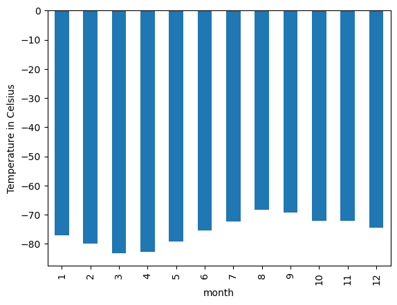
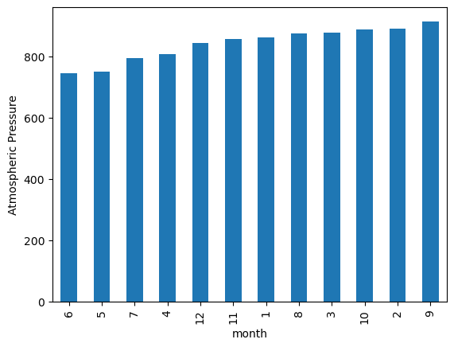
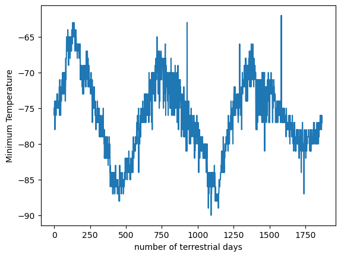

# web_scrapping
In this web-scraping and data analysis project, we are identifying HTML elements on a page, identifying their id and class attributes, and further extracting information via both automated browsing with Splinter and HTML parsing with Beautiful Soup. We are  scraping various types of information, including HTML tables and recurring elements, such as multiple news articles on a webpage.
# Requirements
-Splinter

-BeautifulSoup

-Requests

-Pandas

-Matplotlib

-ChromeDriverManager

-Pymongo

This challege is consisted on two parts:

-Scrape titles and preview text from Mars news articles

-Scrape and analyze Mars weather data, which exists in a table

# Part 1: Scrape Titles and Preview Text from Mars News
 Jupyter Note book **part_1_mars_news.ipynb** provided in the repository is 
 used to complete this part of the assignment. 

 we have Used the automated browsing to visit the Mars news https://static.bc-edx.com/data/web/mars_news/index.html to an external site.. 
 We Inspected the page to identify which elements to scrape.

 A Beautiful Soup object is created and used  to extract text elements from the website.

The titles and preview text of the news articles has been extracted from the scraped data. Then the scraping results is stored in Python data structures as follows:

Each title-and-preview pair is stored in a Python dictionary and, each dictionary is given two keys: title and preview. 
After that all the dictionaries are stored in a Python list.

# Deliverable 2: Scrape and analyze Mars weather data

The Jupyter Notebook named **part_2_mars_weather.ipynb** has all the code to show all the steps to scrape and analyze Mars weather data.

This part Used automated browsing to visit the Mars Temperature Data SiteLinks to an external site. Note that the URL is https://static.bc-edx.com/data/web/mars_facts/temperature.html.

This page has been Inspected by using the google tool **Inspect**  to identify which elements to scrape.

A Beautiful Soup object is used to scrape the data in the HTML table.
The scraped data has been assembled into a Pandas DataFrame.

The data types of the columns have been converted  to the appropriate datetime, int, or float data types.

Dataset has been analyzed by using Pandas functions to answer a series questions.
The first question asks us about the Number of months on Mars:
There are 12 months on Mars. 

Number of Martian (and not Earth) days worth of data exist in the scraped dataset is** 1867** and calculated by using the count function on the month column.

Identifying the coldest and the warmest months on Mars (at the location of Curiosity)? 
To answer this question this question Groupby funtion has been used on month and min temp columns and after that calculating the mean.  
Find the average minimum daily temperature for all of the months? for this bit a bar chart has been plotted.

Which months have the lowest and the highest atmospheric pressure on Mars? 

To answer this question: We find the average daily atmospheric pressure of all the months and then Plot the results as a bar chart.

About how many terrestrial (Earth) days exist in a Martian year? To answer this question:For answering this question we Visually estimate the result by plotting the daily minimum temperature.

Finally DataFrame has been exported to a CSV file and stored in the resources folder.
After completeting the web scraping and data analysis the browser has been closed.